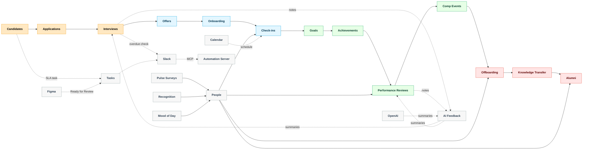

# EchoHR

Executable Notion seeder for a hackathon-ready employee lifecycle management system.

Primary operational model:

- `Notion MCP` for day-to-day agent-driven operations and updates
- `Notion API` for deterministic bulk provisioning and scripted bootstrap
- `Make` / `Zapier` for cross-system triggers

Security note:

- do not commit Notion secrets or issued access tokens

## What this repo does

It creates an `EchoHR` workspace structure inside Notion with:

- top-level hub pages
- lifecycle databases
- key relations and rollups
- seeded message and checklist templates
- automation playbook pages
- realistic demo records across hiring, onboarding, reviews, engagement, and offboarding
- a startup-scale dummy dataset with roughly 50 people, active hiring, and annual review records
- founders, execs, HR/People, managers, and IC reporting lines seeded into the org structure
- first-class goals and achievements linked into reviews and appraisals
- Notion MCP guidance and reusable operational prompts
- a local automation server for OpenAI and Slack glue
- Make and Zapier starter scenario manifests
- versioned installs (`EchoHR HQ vN (latest)`) with automatic unarchive-and-retitle of older versions on `--force-new`

## What you need

1. A Notion internal integration token
2. A parent Notion page shared with that integration
3. Node 22+

## Environment

Copy `.env.example` to `.env` and fill in:

- `NOTION_TOKEN`
- `NOTION_PARENT_PAGE_ID`

Optional:

- `NOTION_VERSION` defaults to `2025-09-03`
- `OPENAI_API_KEY`
- `OPENAI_MODEL`
- `SLACK_BOT_TOKEN`
- `SLACK_DEFAULT_CHANNEL`
- `LOGO_URL` (optional external image for the root icon/top hero block)
- `HERO_VIDEO_URL` (optional external video/embed shown on each section page)
- `FEATURE_FLAGS_PATH` (defaults to `config/feature-flags.json`)
- `PORT` defaults to `8787`

## Run

```bash
npm run create
```

Optional demo content:

```bash
npm run create -- --seed-demo
```

One-command hackathon setup:

```bash
npm run demo
```

Force a brand new install instead of reusing the recorded one:

```bash
npm run demo -- --force-new
```

Dry run:

```bash
npm run create -- --dry-run
```

Run the local automation server:

```bash
npm run automation-server
```

MCP-style polling (no webhooks):  
```bash
STATUS_WATCH_WINDOW_MIN=15 npm run mcp-status-watch
```
Reads `.echohr-install-state.json`, queries recent edits, and posts Slack status updates without Notion webhooks.

Expose the local automation server as an MCP endpoint (for STDIO-only MCP clients):

```bash
npm run mcp-remote:local
```

Recreate everything from scratch (new versioned root, refreshed schemas, rollups, demo data):

```bash
npm run demo -- --force-new
```

Webhook + automation endpoints (MCP-friendly):

- `POST /webhooks/notion` — reacts to Notion events:
  - New Candidate → auto-create Application + SLA Task for the stage owner
  - Offer set to Accepted → auto-create Onboarding Journey + first 3 monthly Check-ins
- `POST /webhooks/figma` — Figma “Ready for Review” comment → creates a Notion Review task (type Review) due tomorrow and posts Slack if configured
- `POST /webhooks/meeting-notes` — body `{kind: "interview"|"review", interviewId/reviewId, notes}` → AI summary back into Notion (candidate-safe + manager actions) + Slack notify
- `POST /slack/notify` — simple Slack DM/channel helper
- `POST /summaries/interview|review|exit` — OpenAI summaries ready to write back to Notion
- `POST /ops/feedback-sweep` — finds interviews completed >7 days with no feedback and pings Slack (and optional EMAIL_WEBHOOK)
- `POST /ops/feature-flags` — override feature flags at runtime `{ "flags": { "slack_notifications": false, ... } }`
- `POST /ops/status-sweep` — scan recent edits (last 15m) across lifecycle DBs and post Slack status updates
- `GET /health` — status

Make/Zapier/Figma glue:

- Example scenario: `automations/make/figma-status-to-notion.json` — when a Figma frame hits “Ready for Review”, create/update a Notion Task, attach to the right Check-in, and post to Slack with a thumbnail.

UI & dashboards:
- Notion API can’t create views; use the recipes in `docs/views-and-dashboards.md` to add boards, timelines, galleries, and embeds so the workspace feels like a product, not a spreadsheet. (Includes which properties, grouping, filters, and suggested charts.)
- For faster polish, see `docs/user-experience.md` for covers, color themes, portal layouts (candidate/new-hire/employee), mood-of-day and celebrations, and dashboard block recipes.
- Every fresh install creates a “Setup Views (5–10 min)” page under the root with the key view instructions; each section page links to it via a callout.

## How to test the app (end-to-end)

Prereqs:
- Run `npm run demo -- --force-new` at least once to generate `.echohr-install-state.json`.
- Set `NOTION_TOKEN` in `.env` (internal integration secret). Optional: `OPENAI_API_KEY`, `SLACK_BOT_TOKEN`, `FIGMA_TOKEN`.

Start the automation server:
```bash
npm run automation-server
```

Health check:
```bash
curl http://127.0.0.1:8787/health
```

Slack test (optional):
```bash
curl -X POST http://127.0.0.1:8787/slack/notify \
  -H "Content-Type: application/json" \
  -d '{"text":"EchoHR ping","channel":"#general"}'
```

Figma webhook (Ready for Review → Notion task + Slack):
```bash
cat <<'JSON' >/tmp/figma.json
{
  "comment": {
    "message": "Ready for Review",
    "file_key": "YOUR_FILE_KEY",
    "client_meta": { "node_id": "0:1" },
    "file_url": "https://www.figma.com/file/YOUR_FILE_KEY/Name"
  }
}
JSON
curl -X POST http://127.0.0.1:8787/webhooks/figma \
  -H "Content-Type: application/json" \
  -d @/tmp/figma.json
```

Meeting notes → AI feedback:
```bash
curl -X POST http://127.0.0.1:8787/webhooks/meeting-notes \
  -H "Content-Type: application/json" \
  -d '{"kind":"interview","interviewId":"<interview_page_id>","notes":"Candidate demonstrated strong systems thinking..."}'
```

Feedback sweep (interviews completed >7 days ago with no feedback):
```bash
curl -X POST http://127.0.0.1:8787/ops/feedback-sweep
```

Notion webhook automations:
- New Candidate → Application + SLA Task  
  ```bash
  curl -X POST http://127.0.0.1:8787/webhooks/notion \
    -H "Content-Type: application/json" \
    -d '{"event":{"type":"page_created","data":{"id":"<candidate_page_id>","parent":{"data_source_id":"<candidates_ds_id>"}}}}'
  ```
- Offer Accepted → Onboarding Journey + 3 monthly Check-ins (set Offer Status=Accepted in Notion first)  
  ```bash
  curl -X POST http://127.0.0.1:8787/webhooks/notion \
    -H "Content-Type: application/json" \
    -d '{"event":{"type":"page_updated","data":{"id":"<offer_page_id>","parent":{"data_source_id":"<offers_ds_id>"}}}}'
  ```

AI summaries (writes JSON back for you to paste into Notion):
```bash
curl -X POST http://127.0.0.1:8787/summaries/interview \
  -H "Content-Type: application/json" \
  -d '{"candidate":"Asha Patel","notes":"..." }'
```
(Similarly: `/summaries/review`, `/summaries/exit`.)

MCP end-to-end:
- MCP clients (Cursor/Claude/ChatGPT MCP) auto-read `mcp.json` and connect to the hosted Notion MCP server.
- STDIO-only clients: `npm run mcp-remote:local` to expose the local automation server as an MCP endpoint, or `npx -y mcp-remote https://mcp.notion.com/mcp` for hosted.
- VS Code: `.vscode/settings.json` points MCP-capable extensions to `./mcp.json`; authenticate when prompted.

Figma flows:
- Local webhook: `POST /webhooks/figma` with a Figma comment payload containing “Ready for Review” → Notion Review task (due tomorrow) + Slack notify (if configured).
- Make scenario: `automations/make/figma-status-to-notion.json` — when a Figma frame hits “Ready for Review,” create/update a Notion Task, attach to a Check-in, and post to Slack with a thumbnail.

Feature flags (admin controls):
- File: `config/feature-flags.json` (copy from example). Flags: `slack_notifications`, `ai_summaries`, `auto_candidate_applications`, `auto_onboarding_from_offer`, `feedback_sweep`.
- Runtime override: `curl -X POST http://127.0.0.1:8787/ops/feature-flags -H "Content-Type: application/json" -d '{"flags":{"slack_notifications":false}}'`
- `/health` reports current flags.

## MCP client setup

Notion hosts an MCP server. Point your MCP-capable client at it:

```json
{
  "mcpServers": {
    "Notion": { "type": "http", "url": "https://mcp.notion.com/mcp" },
    "NotionSseFallback": { "type": "sse", "url": "https://mcp.notion.com/sse" },
    "Figma": { "type": "http", "url": "https://mcp.figma.com/mcp" },
    "Slack": { "type": "http", "url": "https://mcp.slack.com/mcp" },
    "Calendar": { "type": "http", "url": "https://mcp.calendar.com/mcp" }
  }
}
```

- Example configs: `mcp/mcp-client-config.example.json` and root-level `mcp.json` (most MCP clients auto-read it).
- Authenticate with your Notion account when prompted by the client (Cursor, Claude Desktop, ChatGPT MCP, etc.).
- For STDIO-only clients, wrap the hosted server with `mcp-remote`: `npx -y mcp-remote https://mcp.notion.com/mcp`.

Multi-agent MCP (optional):

- Use `mcp/multi-agent-config.example.json` as a template to add additional MCP servers alongside Notion.
- Example entry included to wrap the local automation server via `mcp-remote` when you run `npm run automation-server`.
- Add your own MCP servers (e.g., internal tools, vector search, monitoring) to orchestrate cross-system workflows in one MCP-aware client.

VS Code MCP convenience:

- `.vscode/settings.json` points MCP-capable VS Code extensions to `./mcp.json`.

Runbooks & CI:
- Ops runbooks: [docs/runbooks.md](/Users/ujja/code/personal/echohr/docs/runbooks.md)
- Testing/CI: [docs/testing-ci-cd.md](/Users/ujja/code/personal/echohr/docs/testing-ci-cd.md), GitHub Action at `.github/workflows/ci.yml`.

## Output

After a successful run, the script writes local IDs and URLs to:

- `echohr-install-output.json`
- `.echohr-install-state.json`

Automation assets live in:

- `automations/make`
- `automations/zapier`
- `automations/prompts`
- `automations/samples`
- `mcp`

Lifecycle automation intent:



- zero ghosting for candidates through explicit update deadlines
- zero silent appraisal cycles through linked goals, achievements, and feedback nudges
- visible onboarding, check-in, review, offboarding, and alumni next steps

Notion MCP usage:

- use Notion MCP for ongoing record updates, summaries, reminders, dashboard maintenance, and lifecycle follow-through
- use the seeder in this repo for initial workspace bootstrap, because it is easier to keep deterministic than conversational MCP creation
- MCP drives the Notion `data_source` endpoints for relations, rollups, and queries (no legacy `database_id` queries), enabling reliable dual relations and rollups
- use MCP prompts in `mcp/notion-mcp-playbook.md` to drive candidate updates, review evidence sync, offboarding follow-up, mood/celebration pings, and zero-ghosting checks

Internal Notion integration guidance:

- connect the `Echo HR` integration to the parent page before running the seeder
- use the internal integration secret directly as `NOTION_TOKEN`
- bootstrap EchoHR into a normal Notion page, not an existing database page

## Notes

- The script uses the current Notion `database` + `data source` APIs directly with `fetch`; no external dependencies are required.
- By default, reruns reuse the previously recorded EchoHR install and will not create another top-level page unless you pass `--force-new`.
- Fresh installs are titled `EchoHR HQ v1 (latest)`, `EchoHR HQ v2 (latest)`, and so on. When a newer forced install is created, the previous root page drops the `latest` suffix.
- Notion still does not expose full view management through the API, so dashboard view layouts remain a short manual pass in the app.
- Formula properties cannot be updated after creation via the API, so formulas are implemented only where they can be created safely during provisioning.
- The local automation server exposes `GET /health`, `POST /summaries/interview`, `POST /summaries/review`, `POST /summaries/exit`, `POST /slack/notify`, `POST /webhooks/notion`, and `POST /webhooks/slack`.
- Rollups are created through the `data_source` endpoint (with database fallback) after schema refresh; if you see rollup skips, run `npm run demo -- --force-new` to regenerate a clean version.
