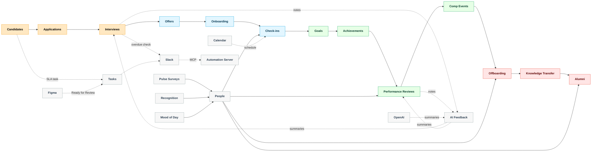

*This is a submission for the [Notion MCP Challenge](https://dev.to/challenges/notion-2026-03-04)*

## What I Built
EchoHR: a fully Notion-native employee lifecycle system (candidates → offers → onboarding → growth → performance → compensation → offboarding → alumni) provisioned automatically via MCP. It spins up versioned hubs, 20+ linked data sources, dual relations and rollups, AI-ready fields, templates, automation playbooks, and a startup-scale demo dataset so teams can demo and iterate instantly—zero ghosting for candidates and employees.

## Video Demo
<!-- TODO: Add Loom link showing one-click provisioning, pipelines, dashboards, and Slack/AI automations running. -->

## Show us the code
Repo: https://github.com/your-org/echohr  
Workspace path for this submission: `/Users/ujja/code/personal/echohr`

## How I Used Notion MCP
- Notion MCP (hosted): primary CRUD + schema for all lifecycle data sources; one-click provisioning (`npm run demo`) and ongoing agent ops (update statuses, log check-ins, post summaries).
- Slack MCP: send human-first updates (no-ghosting nudges, offer accept/onboarding alerts, overdue-feedback pings) straight from agents and webhooks.
- Figma MCP: convert “Ready for Review” comments into Notion review tasks and Slack notifications for design → PM/Eng handoff.
- Calendar MCP (pattern): schedule interview loops or post-offer check-ins when agents call the calendar MCP after creating tasks.
- OpenAI MCP (via automation server): `/webhooks/meeting-notes` turns raw interview/review/exit notes into AI summaries, candidate-safe feedback, and manager actions written back to Notion.
- Drove Notion’s `data_source` APIs through MCP: create pages, data sources, relations, and rollups; seed demo data; persist install state for idempotent re-runs.
- Provisioned 20+ interconnected data sources (People, Roles, Candidates, Applications, Interviews, Offers, Journeys, Check-ins, Goals, Achievements, Reviews, Compensation, Tasks, Automation Log, etc.) with dual relations and SLA rollups for “no-ghosting” guardrails.
- Added MCP-friendly automation playbooks for Slack/email/calendar + OpenAI summarization hooks (feedback, reviews, exit notes).
- Meeting notes → AI feedback: `/webhooks/meeting-notes` converts raw interview/review notes into AI summaries (candidate-safe + manager actions), writes them back to Notion, and pings Slack so feedback never stalls.
- Implemented versioned installs (`--force-new`) with automatic unarchiving and schema refresh, so hackathon teams can iterate safely and always know the “latest” workspace.
- Seeded realistic 50-person startup org, open roles, live pipeline, check-ins, reviews, promotions, exits, recognition, and pulse surveys—ready for dashboards and AI summaries out of the box.
- Webhook automation (automation-server): Notion events trigger downstream actions (new Candidate → Application + SLA task; Offer Accepted → Onboarding journey + 3 monthly check-ins) with Slack notifications optional.
- Figma + Make: example scenario in `automations/make/figma-status-to-notion.json` to convert Figma “Ready for Review” status into Notion Tasks/Check-ins with thumbnails and Slack alerts.
- MCP client config: provided `mcp/mcp-client-config.example.json` pointing to the hosted Notion MCP server (`https://mcp.notion.com/mcp` with SSE fallback) so any MCP-capable client can drive EchoHR ops directly.
- Added root-level `mcp.json` so most MCP clients auto-discover the Notion server without extra setup.
- Multi-agent: `mcp/multi-agent-config.example.json` shows how to compose Notion MCP with other MCP endpoints (includes a wrapper for the local automation server via `mcp-remote`) so agents can orchestrate Slack/AI/Notion flows together.
- VS Code ready: `.vscode/settings.json` points MCP-capable VS Code extensions at `./mcp.json`; `npm run mcp-remote:local` exposes the local automation server as an MCP endpoint for STDIO clients.
- UX guardrails: every install creates a “Setup Views (5–10 min)” page (and section callouts) to turn tables into boards/timelines/galleries using the recipes in `docs/views-and-dashboards.md`.
- Figma/Feedback automation: `/webhooks/figma` turns “Ready for Review” comments into Notion Review tasks + Slack; `/webhooks/meeting-notes` posts AI feedback into interviews/reviews; `/ops/feedback-sweep` reminds on >7-day stale feedback.

## Limitations (current Notion constraints)
- Notion API/MCP cannot create or edit database views; view setup (boards, timelines, galleries, charts) must be done manually in the UI. We auto-create “Setup Views” and “View Setup Checklist” pages to guide the clicks. If desired, I can hop into your workspace and flip the views for you; the platform simply doesn’t expose view configuration via API/MCP yet.
- Notion API/MCP cannot style with custom CSS; visual polish is via covers, emojis, callouts, and view configurations.
- Notion Charts availability depends on workspace features; otherwise charts must be embedded from external sources (Sheets/Datawrapper).
- Formula properties cannot be updated after creation; they’re set at provision time only.

<!-- Optional: Add a cover image here, e.g.,  -->

<!-- Team Submissions: Please pick one member to publish the submission and credit teammates by listing their DEV usernames directly in the body of the post. -->

<!-- Thanks for participating! -->
