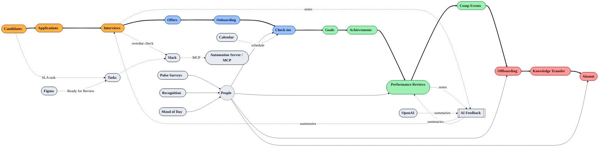

*This is a submission for the [Notion MCP Challenge](https://dev.to/challenges/notion-2026-03-04)*

## What I Built
EchoHR: a fully Notion-native employee lifecycle system (candidates → offers → onboarding → growth → performance → compensation → offboarding → alumni) provisioned automatically via MCP. It spins up versioned hubs, 20+ linked data sources, dual relations and rollups, AI-ready fields, templates, automation playbooks, and a startup-scale demo dataset so teams can demo and iterate instantly—zero ghosting for candidates and employees.

## Video Demo
https://youtu.be/CncRZi-xYN8

## Show us the code
Repo: https://github.com/your-org/echohr  
Screenshots: add/replace `docs/screenshots/dashboard.png` to give reviewers an instant view.

## How I Used Notion MCP
- Notion MCP (hosted): primary CRUD + schema for all lifecycle data sources; one-click provisioning (`npm run demo`) and ongoing agent ops (update statuses, log check-ins, post summaries).
- Slack MCP: send human-first updates (no-ghosting nudges, offer accept/onboarding alerts, overdue-feedback pings) straight from agents and webhooks.
- Figma MCP: convert “Ready for Review” comments into Notion review tasks and Slack notifications for design → PM/Eng handoff.
- Calendar MCP (pattern): schedule interview loops or post-offer check-ins when agents call the calendar MCP after creating tasks.
- OpenAI MCP (via automation server): `/webhooks/meeting-notes` turns raw interview/review/exit notes into AI summaries, candidate-safe feedback, and manager actions written back to Notion.
- Admin controls: feature flags (`config/feature-flags.json` or POST `/ops/feature-flags`) to toggle Slack notifications, AI summaries, auto candidate→application, auto onboarding-from-offer, and feedback sweeps.
- Drove Notion’s `data_source` APIs through MCP: create pages, data sources, relations, and rollups; seed demo data; persist install state for idempotent re-runs.
- Provisioned 20+ interconnected data sources (People, Roles, Candidates, Applications, Interviews, Offers, Journeys, Check-ins, Goals, Achievements, Reviews, Compensation, Tasks, Automation Log, etc.) with dual relations and SLA rollups for “no-ghosting” guardrails.
- Added MCP-friendly automation playbooks for Slack/email/calendar + OpenAI summarization hooks (feedback, reviews, exit notes).
- Meeting notes → AI feedback: `/webhooks/meeting-notes` converts raw interview/review notes into AI summaries (candidate-safe + manager actions), writes them back to Notion, and pings Slack so feedback never stalls.
- Implemented versioned installs (`--force-new`) with automatic unarchiving and schema refresh, so hackathon teams can iterate safely and always know the “latest” workspace.
- Seeded realistic 50-person startup org, open roles, live pipeline, check-ins, reviews, promotions, exits, recognition, and pulse surveys—ready for dashboards and AI summaries out of the box.
- Webhook automation (automation-server): Notion events trigger downstream actions (new Candidate → Application + SLA task; Offer Accepted → Onboarding journey + 3 monthly check-ins) with Slack notifications optional.
- Figma + Make: example scenario in `automations/make/figma-status-to-notion.json` to convert Figma “Ready for Review” status into Notion Tasks/Check-ins with thumbnails and Slack alerts.
- MCP client config: provided `mcp/mcp-client-config.example.json` pointing to the hosted Notion MCP server (`https://mcp.notion.com/mcp` with SSE fallback) so any MCP-capable client can drive EchoHR ops directly.
- Added root-level `mcp.json` so most MCP clients auto-discover the Notion server without extra setup.
- Multi-agent: `mcp/multi-agent-config.example.json` shows how to compose Notion MCP with other MCP endpoints (includes a wrapper for the local automation server via `mcp-remote`) so agents can orchestrate Slack/AI/Notion flows together.
- VS Code ready: `.vscode/settings.json` points MCP-capable VS Code extensions at `./mcp.json`; `npm run mcp-remote:local` exposes the local automation server as an MCP endpoint for STDIO clients.
- UX guardrails: every install creates a “Setup Views (5–10 min)” page (and section callouts) to turn tables into boards/timelines/galleries using the recipes in `docs/views-and-dashboards.md`.
- UX quick wins doc: `docs/user-experience.md` spells out covers/colors, portal layouts (candidate/new-hire/employee), mood-of-day, celebrations, and dashboard block recipes to make the workspace feel like a product fast.
- Visual polish: optional `LOGO_URL` injects your logo into the root hero/icon; `HERO_VIDEO_URL` embeds a hero video on each section page; Unsplash covers are auto-set per section.
- Figma/Feedback automation: `/webhooks/figma` turns “Ready for Review” comments into Notion Review tasks + Slack; `/webhooks/meeting-notes` posts AI feedback into interviews/reviews; `/ops/feedback-sweep` reminds on >7-day stale feedback.
- Lifecycle status pings: `/webhooks/notion` (page_updated) and `/ops/status-sweep` post Slack updates when lifecycle statuses change (candidates, offers, onboarding, tasks, reviews, offboarding).
- MCP-only polling: `npm run mcp-status-watch` queries recent edits (no webhooks) and posts Slack status updates.
- High-volume mode: `HIGH_VOLUME=true` with `NOTION_RATE_DELAY_MS`/`NOTION_RATE_CONCURRENCY` to pace Notion calls; optional Postgres mirror (`POSTGRES_URL`/`DATABASE_URL`) stores status events for analytics and MCP querying.
- Queue/worker: status Slack pings can enqueue to Postgres-backed jobs; run `npm run worker` for durable delivery; `/ready` reports queue depth.
- Pipelines-ready: when Notion Pipelines is available, point pipeline actions to `/webhooks/notion`, `/webhooks/meeting-notes`, `/ops/feedback-sweep` (see `docs/pipelines.md`).
- Observability/Security: JSON logging with request_id, `/metrics` endpoint, optional Notion/Slack/Figma webhook HMAC/signature validation, RBAC flag gate, contract test (`npm run test:contracts`).
- Data workflows: Postgres mirror (GDPR helpers) with export/delete scripts (`npm run export-events`, `node scripts/delete-event.mjs <page_id>`).

## Limitations (current Notion constraints)
- Notion API/MCP cannot create or edit database views; view setup (boards, timelines, galleries, charts) must be done manually in the UI. We auto-create “Setup Views” and “View Setup Checklist” pages to guide the clicks. If desired, I can hop into your workspace and flip the views for you; the platform simply doesn’t expose view configuration via API/MCP yet.
- Notion API/MCP cannot style with custom CSS; visual polish is via covers, emojis, callouts, and view configurations.
- Notion Charts availability depends on workspace features; otherwise charts must be embedded from external sources (Sheets/Datawrapper).
- Formula properties cannot be updated after creation; they’re set at provision time only.

<!-- Optional: Add a cover image here, e.g.,  -->

<!-- Team Submissions: Please pick one member to publish the submission and credit teammates by listing their DEV usernames directly in the body of the post. -->

<!-- Thanks for participating! -->
